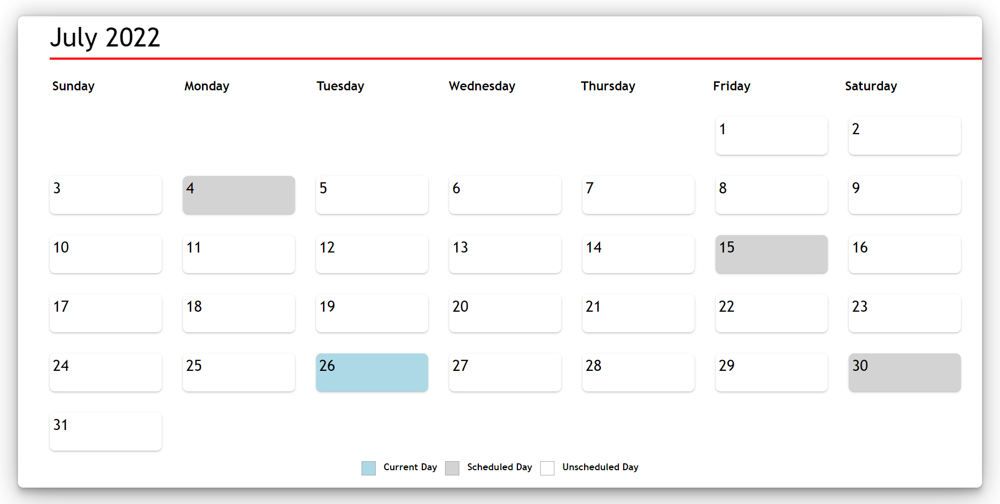
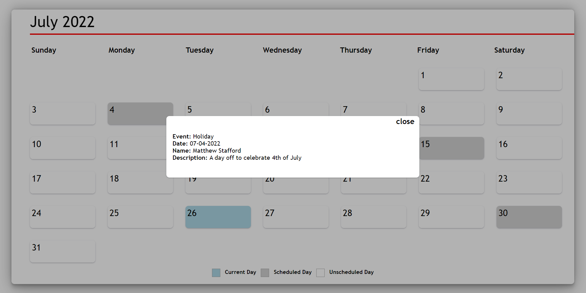
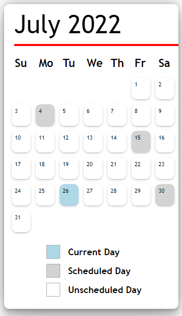

# Calendar App

A simple calendar app which displays a single month of the year and indicates the current, scheduled, and unscheduled days. For scheduled days, clicking on a tile provides the single event details for that day.

## Live Site

https://calendar-app-2022.herokuapp.com/


## Run Locally

Clone the project

```bash
  git clone https://github.com/mfahad24/Calendar-App
```

Go to the project directory

```bash
  cd calendar-app
```

Install dependencies

```bash
  npm install
```

Start the server

```bash
  npm run start
```


## Run Tests

To run tests, run the following command

```bash
  npm run test
```


## Features

- Displays a calender view for the year of 2022
- Visual representations of the current, scheduled and unscheduled day(s)
- Ability to click on a scheduled day to view the single event on that day


## Future Features

- Ability to add events
- Ability for empty event detail popups to show "No event details" text
- Integration of the frontend with a backend so data can be saved, accessed and deleted 

## Screenshots






